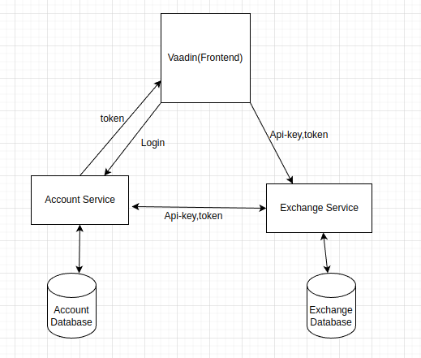
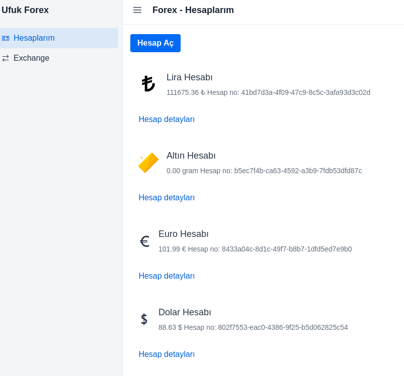
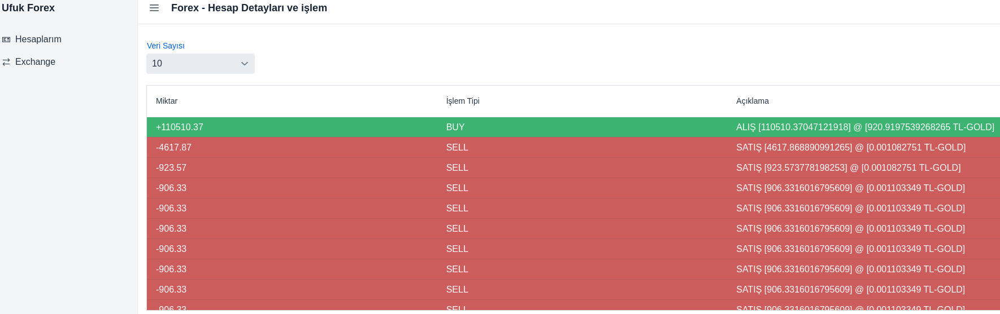
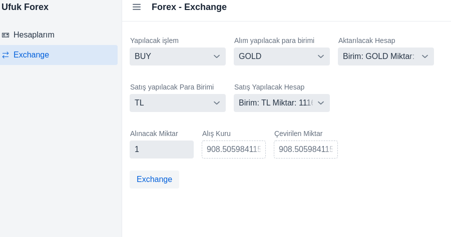

# SimpleAccounting
Ft Teknoloji Practium Case
# Frontend - Vaadin Framework ile kodlandı.
- Frontend uygulaması çalışmaz ise mvn komutu çalıştırılmalı.
```maven
mvn clean package
```
- Swagger configure kalan zaman nedeniyle edilemedi. 
- Veritabanlıarını ayağa kaldırma
- ufuk 123456 hazır kullanıcı - içerisinde işlemler mevcut
- mehmet 123456 hazır kullanıcı
- Account servisinin otomatik olarak hazır verileri ekleyen data.sql i mevcut proje ayağa kalkarken çalışıyor, tekrar ayağa kaldırılırken hata verirse application.ymlden data kısmı silinmeli

# Docker ile veritabanlarını ayağa kaldırma
```
docker-compose up -d
```
- http://localhost:8080/swagger-ui/index.html  Swagger UI
- Frontend http://localhost:8085
- Hesap Servisi http://localhost:8080
- Exchange Servisi http://localhost:8081


# Uygulama ekranları
- login page
- 
- Account page
- 
- Account Activities page
- 
- Exchange page
- 